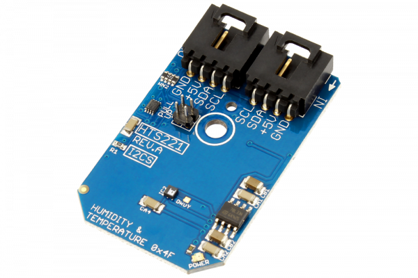

[](https://store.ncd.io/product/hts221-capacitive-digital-sensor-for-relative-humidity-and-temperature-i2c-mini-module/).

# HTS221

The HTS221, manufactured by STMicroelectronics, is a relative humidity and temperature sensor combined in a single package. It includes a sensing element and a mixed signal ASIC to provide the measurement information through the I2C digital serial interface.
This Device is available from www.ncd.io

[SKU: HTS221]

(https://store.ncd.io/product/hts221-capacitive-digital-sensor-for-relative-humidity-and-temperature-i2c-mini-module/)
This Sample code can be used with Raspberry Pi.

Hardware needed to interface HTS221 capacitive digital humidity and temperature sensor With Raspberry Pi :

1. <a href="https://store.ncd.io/product/hts221-capacitive-digital-sensor-for-relative-humidity-and-temperature-i2c-mini-module/">HTS221 capacitive digital humidity and temperature Sensor</a>

2. <a href="https://store.ncd.io/product/i2c-shield-for-raspberry-pi-3-pi2-with-outward-facing-i2c-port-terminates-over-hdmi-port/">Raspberry Pi I2C Shield</a>

3. <a href="https://store.ncd.io/product/i%C2%B2c-cable/">I2C Cable</a>

## Python

Download and install smbus library on Raspberry pi. Steps to install smbus are provided at:

https://pypi.python.org/pypi/smbus-cffi/0.5.1

Download (or git pull) the code in pi. Run the program.

```cpp
$> python HTS221.py
```
The lib is a sample library, you will need to calibrate the sensor according to your application requirement.
